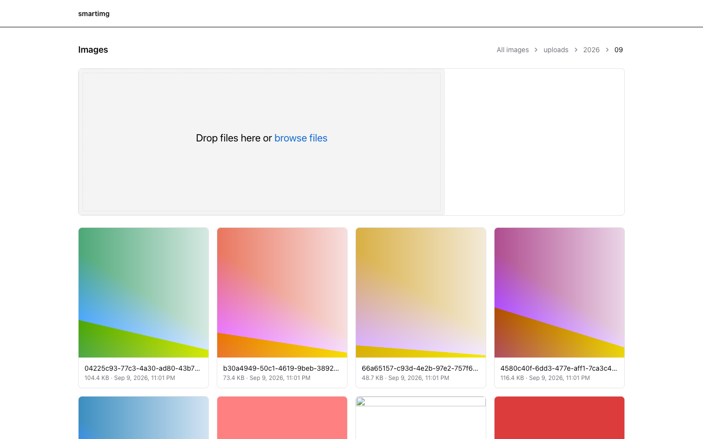
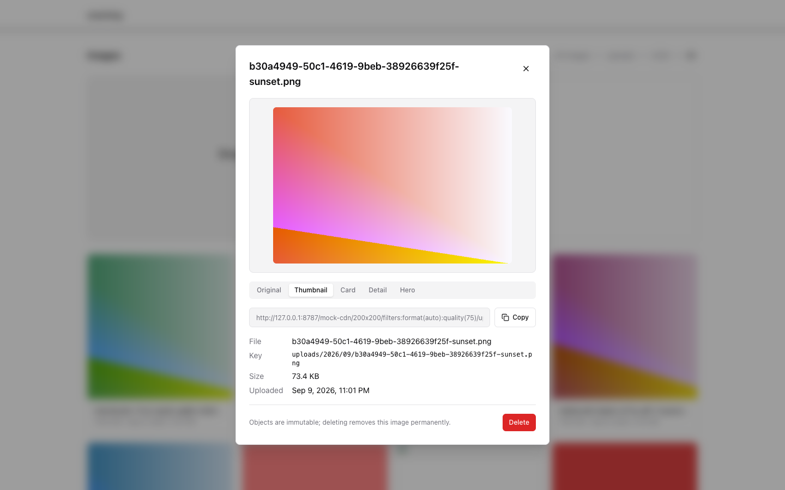

# smartimg

Minimal image hosting on AWS: originals live in a private S3 bucket,
delivery goes through CloudFront with Dynamic Image Transformation
(DIT, Thumbor-style URLs), and a tiny Hono API handles presigned uploads,
listings, and deletes. A web library manages everything in the browser, and
a local folder agent uploads files without opening it.

No database. No image processing of our own. No AWS credentials on client
machines.

## Screenshots

Web image library (folder navigation, drag-and-drop upload, auto refresh):



Detail dialog with preset URLs ready to copy:



## Architecture

```
Admin browser / local agent        API server (Hono)                 AWS
--------------------------        ------------------                 ---
/images page  --presign---------->  signs a PUT URL  -----> S3 (private originals)
  |  ^                                                        |
  |  +--key + URL                                             | OAC (only reader)
  +--PUT bytes (presigned, immutable cache-control) --------->|
                                                              v
Shoppers / email / admin  --GET /200x200/filters:...------> CloudFront + DIT
```

Both upload paths share one backend and one set of rules:

- The server generates every object key: `folder/yyyy/mm/uuid-name.ext`.
  Keys are immutable and collision-safe; the extension comes from the MIME
  type, never the filename.
- Preset URLs are deterministic and canonical. The syntax lives in one
  module (`shared/src/cdn.ts`) so the web app and the local agent build
  identical URLs.
- The API authenticates with a bearer token; clients never touch AWS
  credentials.

## Quickstart (mock mode, no AWS needed)

```
# server/.env
MOCK_S3=true
IMAGE_API_TOKEN=dev-token

# web/.env.local
VITE_IMAGE_CDN_URL=http://127.0.0.1:8787/mock-cdn
VITE_IMAGE_API_TOKEN=dev-token
```

```bash
bun install
bun run dev:api   # http://127.0.0.1:8787
bun run dev:web   # http://localhost:5173 -> /images
```

Mock mode keeps the whole flow (presign, PUT, list, delete, preview) in
memory; previews show the original bytes because there is no local DIT.

For real AWS deployment see [infra/README.md](infra/README.md).

## Web library

`/images` lists the store, navigates folders (`uploads/2026/09`), uploads
via drag-and-drop or file picker, and opens a detail dialog per image with
the original URL plus every preset URL ready to copy. The library polls for
changes, so images uploaded by the local agent appear automatically. Objects
are immutable; deleting removes an image permanently.

## Local folder agent

Drop files into `~/ImageDrop/Inbox` and the agent uploads them through the
same presign API, then files them into per-outcome folders and writes a
batch report with every CDN URL:

```
~/ImageDrop/
  Inbox/     drop images here
  Uploaded/  successfully uploaded files are moved here
  Failed/    files rejected by the API or the image sniffer are moved here
  Results/   one JSON + Markdown pair per batch, with every CDN URL
```

Run it in the foreground (the API server must be reachable):

```bash
export IMAGE_API_URL=http://127.0.0.1:8787/api
export IMAGE_CDN_BASE=http://127.0.0.1:8787/mock-cdn   # or your CloudFront domain
export IMAGE_API_TOKEN=dev-token                       # only if the server requires it
bun install
bun run --cwd agent src/main.ts
```

Each batch produces `Results/batch-<timestamp>-<id>.json` and `.md`:

```json
{
  "batchId": "batch-20260909-230148-c1d4fad9",
  "finishedAt": "2026-09-09T14:01:48.729Z",
  "results": [
    {
      "status": "uploaded",
      "source": "ocean.png",
      "key": "uploads/2026/09/c5ab0292-...-ocean.png",
      "url": "https://cdn.example.com/uploads/2026/09/c5ab0292-...-ocean.png",
      "presets": {
        "thumbnail": "https://cdn.example.com/200x200/filters:format(auto):quality(75)/uploads/2026/09/c5ab0292-...-ocean.png",
        "productCard": "https://cdn.example.com/480x480/filters:format(auto):quality(80)/uploads/2026/09/c5ab0292-...-ocean.png",
        "productDetail": "https://cdn.example.com/fit-in/1200x0/filters:format(auto):quality(80)/uploads/2026/09/c5ab0292-...-ocean.png",
        "hero": "https://cdn.example.com/fit-in/1920x0/filters:format(auto):quality(80)/uploads/2026/09/c5ab0292-...-ocean.png"
      }
    }
  ]
}
```

The agent never stores AWS credentials. It only talks to the image API with
an optional bearer token; the server performs the S3 presigning and key
naming. For automatic startup on macOS, see the launchd template and setup
guide in [agent/README.md](agent/README.md).

## API

All routes are under `/api`, authenticated with `Authorization: Bearer
IMAGE_API_TOKEN`.

| Method | Route | Body / query | Response |
| --- | --- | --- | --- |
| POST | /api/images/presign | filename, contentType, size, folder? | key, method: PUT, url, headers |
| GET | /api/images | folder?, nextToken? | objects[], folders[], nextToken |
| DELETE | /api/images/:key | - | 204 |

## Presets

| Preset | Transform | Use |
| --- | --- | --- |
| thumbnail | 200x200 crop, quality 75 | grid thumbnails |
| productCard | 480x480 crop, quality 80 | product cards |
| productDetail | fit-in/1200x0, quality 80 | product detail page |
| hero | fit-in/1920x0, quality 80 | full-width heroes |

## Project structure

```
server/   Hono API: presign, list, delete; S3 or in-memory mock store
web/      React (Vite) image library at /images
agent/    TypeScript folder watcher (Chokidar) with launchd template
shared/   CDN preset URL builder used by web and agent
infra/    CloudFormation for the private bucket + CloudFront/OAC setup
```

## Development

```bash
bun run check        # biome lint + format
bun run typecheck    # all workspaces
bun run test         # server + web + agent (incl. agent e2e)
```
